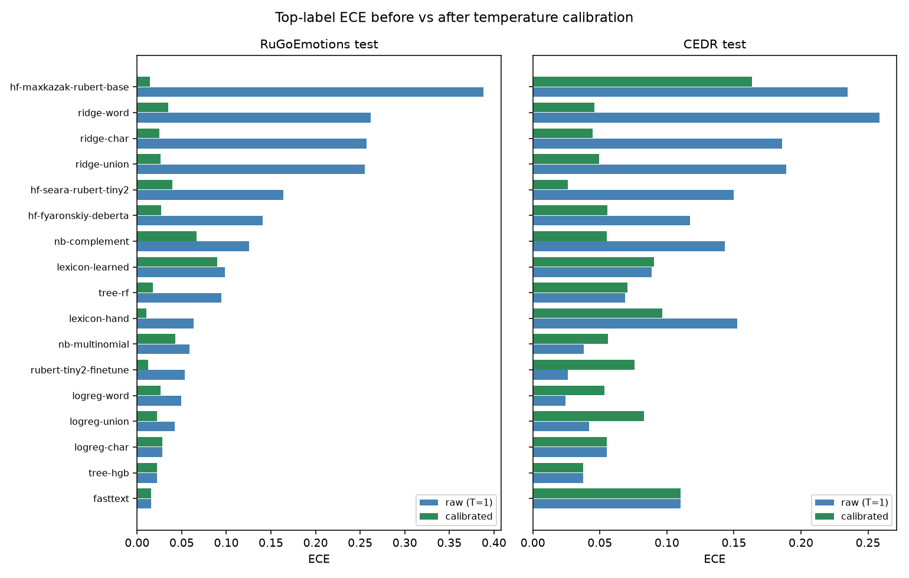
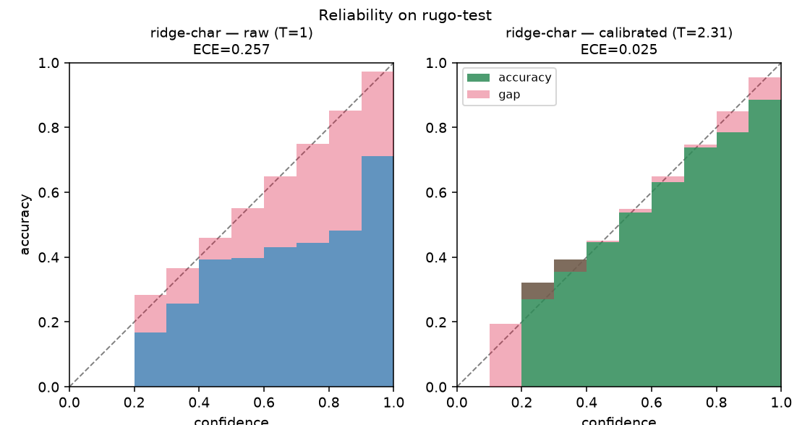
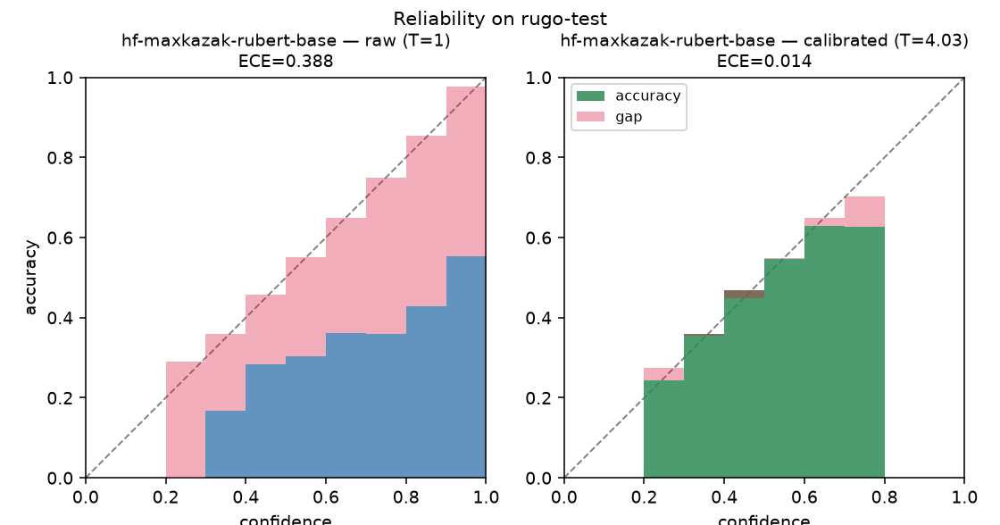
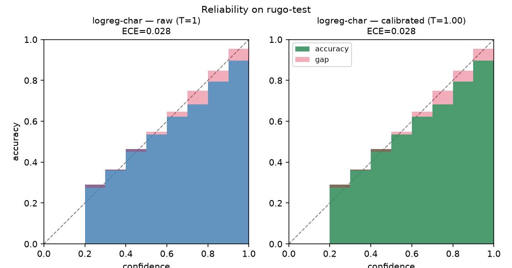

# Температурная калибровка моделей (по ECE)

Раздел для диплома. Лидерборды репортят «сырую» (T=1) калибровку каждой модели; здесь —
пост-хок калибровка температурой всех 20 сохранённых чекпоинтов и честное сравнение
**ECE до/после**. Источник: `scripts/calibrate_temperature.py` →
`artifacts/experiments/calibration/temperature_calibration.csv`.

## Зачем

**ECE (Expected Calibration Error)** — top-label калибровка: среднее по бинам уверенности
`|средняя уверенность − фактическая точность|`. ECE = 0 означает, что когда модель говорит
«0.8», она права в 80% случаев. Для шкалы эмоций на таймлайне это важно: высота столбика
должна отражать реальную вероятность, а не «модель всегда орёт 0.99».

Беда линейных TF-IDF моделей (наши деплой-кандидаты) — **переуверенность**: их softmax
почти one-hot, тогда как top-1 accuracy ≈ 0.5–0.7, поэтому top-label ECE = 0.25–0.40.

## Метод

**Temperature scaling** (Guo et al., 2017): один скаляр T делит логиты *до* softmax —
`softmax(logits / T)`. `T>1` смягчает распределение (снижает уверенность), `T<1` заостряет,
`T=1` — no-op. Применяется единообразно к любой модели через её `predict_logits`.

Ключевое свойство: **argmax инвариантен** при любом положительном T, поэтому
**accuracy / F1 / матрица ошибок не меняются** — калибровка «бесплатна» по качеству
классификации; двигаются только вероятности (KL, NLL, ECE).

Протокол (честный):

1. T подбирается **per-model на валидации RuGo** (отложенной от обучения), минимизацией
   **val ECE** — той самой метрики, что мы репортим.
2. **Дедбанд:** T остаётся ровно `1.0`, если выигрыш по val ECE меньше порога **ε = 0.005**.
   Binned ECE — шумная оценка на конечной выборке, и у уже калиброванной модели её минимум на
   val лежит на волосок ниже T = 1 чисто по сэмплинг-шуму; дедбанд не даёт «поймать» этот шум
   (обоснование порога — в разделе «Почему ECE мог вырасти»).
3. **Контроль:** второй T подбирается по **NLL** (гладкий учебниковый суррогат, который
   классически минимизируют). T(ECE) ≈ T(NLL) у всех, кроме двух вырожденных случаев →
   отбор по ECE не «подгоняет бины».
4. «До/после» считается на **held-out**: RuGo **test** (5371) + нативный **CEDR** test (1882).
   Температура подобрана не на этих данных → цифры не самооптимизированы.
5. Для CEDR добавлена колонка **oracle T** (подобран прямо на CEDR) — оптимистичная граница:
   показывает потолок ECE, достижимый при наличии нативного dev-набора целевого домена.

Всё считается на кэшированных логитах, так что подбор T — это десяток softmax на модель;
единственная реальная стоимость — однократная загрузка каждого чекпоинта.

## Результаты (ECE до → после; accuracy не меняется)

T\* — температура, подобранная на val RuGo по ECE (с дедбандом). Сортировка по «сырому» RuGo
ECE (худшие сверху). `T* = 1.00` означает, что дедбанд оставил модель как есть (raw = cal).

| модель | T\* | RuGo ECE (raw→cal) | RuGo KL (raw→cal) | CEDR ECE (raw→cal) | CEDR ECE (oracle T) |
|---|---|---|---|---|---|
| hf-maxkazak-rubert-base | 4.04 | **0.388 → 0.014** | 7.45 → 2.70 | 0.235 → 0.164 | 0.057 |
| ridge-word | 2.21 | **0.262 → 0.035** | 1.52 → 1.19 | 0.258 → 0.046 | 0.040 |
| ridge-char | 2.31 | **0.257 → 0.025** | 1.46 → 1.09 | 0.186 → 0.045 | 0.029 |
| ridge-union | 2.37 | **0.255 → 0.026** | 1.46 → 1.08 | 0.189 → 0.049 | 0.036 |
| hf-seara-rubert-tiny2 | 1.63 | 0.164 → 0.039 | 1.32 → 1.22 | 0.150 → 0.026 | 0.022 |
| hf-fyaronskiy-deberta | 1.63 | 0.140 → 0.027 | 1.01 → 0.92 | 0.117 → 0.055 | 0.019 |
| nb-complement | 0.69 | 0.126 → 0.067 | 1.31 → 1.28 | 0.143 → 0.055 | 0.054 |
| lexicon-learned | 1.05 | 0.099 → 0.090 | 1.45 → 1.45 | 0.089 → 0.090 | 0.078 |
| tree-rf | 0.68 | 0.094 → 0.018 | 1.35 → 1.33 | 0.069 → 0.070 | 0.027 |
| lexicon-hand | 0.78 | 0.063 → 0.010 | 1.68 → 1.66 | 0.152 → 0.097 | 0.027 |
| nb-multinomial | 1.33 | 0.058 → 0.043 | 1.20 → 1.18 | 0.038 → 0.056 | 0.021 |
| rubert-tiny2-finetune | 1.18 | 0.054 → 0.013 | 0.98 → 0.97 | 0.026 → 0.076 | 0.020 |
| logreg-word | 1.15 | 0.050 → 0.026 | 1.16 → 1.15 | 0.024 → 0.054 | 0.015 |
| logreg-union | 1.13 | 0.042 → 0.022 | 1.07 → 1.06 | 0.042 → 0.083 | 0.022 |
| **logreg-char** | **1.00** | 0.028 → 0.028 | 1.07 → 1.07 | 0.055 → 0.055 | 0.020 |
| tree-hgb | **1.00** | 0.023 → 0.023 | 1.23 → 1.23 | 0.038 → 0.038 | 0.033 |
| fasttext | **1.00** | 0.016 → 0.016 | 1.37 → 1.37 | 0.110 → 0.110 | 0.020 |

Accuracy одинакова для raw и cal (инвариант температуры). На RuGo калибровка нигде не ухудшает
ECE (дедбанд). Полная таблица со всеми колонками (accuracy, KL по обоим доменам, T_nll) — в
CSV. Вырожденные baselines (`majority`, `dummy`, `prior`) в таблицу не вынесены: калибровать
константный предсказатель нечем, их T упирается в край сетки.



*Слева — RuGo test (in-domain): зелёное (откалибровано) ≤ синего (raw) везде. Справа — CEDR
(кросс-домен): in-domain T помогает переуверенным, но у нескольких уже калиброванных моделей
немного ухудшает (зелёное > синего) — см. «Калибровка доменно-зависима».*

### Диаграммы надёжности (reliability diagrams)

Высота столбика — фактическая accuracy в бине уверенности; диагональ — идеальная калибровка;
красное — разрыв (gap), из которого складывается ECE.

`ridge-char` — самый наглядный кейс: raw сильно переуверен (столбики под диагональю, большие
красные разрывы), после T = 2.31 столбики ложатся на диагональ.



`hf-maxkazak-rubert-base` — самый переуверенный (ECE 0.39 → 0.01 при T = 4.03):



`logreg-char` (деплой) — уже на диагонали, дедбанд держит T = 1, обе панели почти совпадают —
калибровать нечего:



## Выводы

1. **Где калибровка решает.** Самые переуверенные — пресет `maxkazak` (ECE 0.39) и всё
   семейство `ridge` (~0.26): softmax почти one-hot при accuracy 0.5–0.7. Температура
   (T ≈ 2.3–4.0) обрушивает их in-domain ECE до **0.01–0.04 без изменения accuracy**. Это и есть
   главный результат раздела: переуверенность лечится одним скаляром бесплатно.
2. **Кому не нужна.** `logreg-char`, `tree-hgb`, `fasttext` уже хорошо калиброваны in-domain
   (ECE 0.016–0.028) — дедбанд держит их на T = 1 (raw = cal). То есть рекомендуемый деплой
   `logreg-char` достоверен «из коробки», калибровать его не нужно.
3. **Отбор по ECE корректен.** T(ECE) ≈ T(NLL) везде, кроме `maxkazak` (NLL упёрся в потолок
   сетки 20 — экстремальная переуверенность, ECE нашёл внутренний оптимум 4.0) и вырожденного
   `majority`. Совпадение с учебниковым NLL-критерием показывает, что отбор по ECE — не
   эксплуатация бинов.
4. **Калибровка доменно-зависима.** In-domain T переносится на CEDR и снижает ECE у
   переуверенных (`ridge` 0.19 → 0.05; `maxkazak` 0.235 → 0.164). Но для уже калиброванных
   in-domain моделей RuGo-температура CEDR не лечит (`fasttext` остаётся на T = 1 и CEDR 0.110),
   а у `rubert-finetune` навязанный T даже ухудшает CEDR (0.026 → 0.076). Колонка **oracle T**
   показывает разрыв: нативный dev целевого домена закрывает его почти полностью (`fasttext`
   CEDR 0.110 → 0.020, `maxkazak` 0.235 → 0.057). Вывод: калибровать надо на dev той области,
   где вероятности будут использоваться.
5. **Практика деплоя.** Если выбрать `ridge-char` ради более высокой CEDR-accuracy (0.68), его
   **обязательно** калибровать (T ≈ 2.3) — иначе шкала уверенности на таймлайне недостоверна
   (ECE 0.26). `logreg-char` калибровки не требует.

## Почему ECE мог вырасти после калибровки (и почему в финале не растёт)

Если подбирать T «наивно» (минимум val ECE без дедбанда), у уже хорошо калиброванных моделей
(`logreg-char`, `fasttext`, `tree-hgb`) RuGo ECE слегка **росло** после калибровки. Причина —
переобучение под шум бинированного ECE, а не реальная калибровка.

Эти модели уже у «пола» ECE in-domain (0.016–0.028 — на уровне сэмплинг-шума 10-бинного ECE на
~5k примеров), исправлять нечего. ECE на val — шумная конечновыборочная статистика; её минимум
лежит на ~0.001–0.002 ниже T = 1 чисто случайно, и этот «выигрыш» не переносится на test:

| модель | val ECE @T=1 | val ECE @T\* | test ECE @T=1 | test ECE @T\* | T\*(ECE) | T\*(NLL) |
|---|---|---|---|---|---|---|
| logreg-char | 0.0241 | **0.0224** | 0.0284 | 0.0320 | 0.98 | 1.03 |
| fasttext | 0.0154 | **0.0140** | 0.0157 | 0.0169 | 0.98 | 1.42 |

T = 0.98 минимизирует **val** ECE, но на **test** оптимум наоборот — T > 1; то есть val-минимум
сидит не с той стороны от единицы, и навязанный T поднимает test ECE на ~0.001–0.004 (внутри
шума). Два независимых признака, что сигнала нет:

- **направления критериев расходятся:** T(ECE) = 0.98 (заострить) против T(NLL) = 1.03–1.42
  (смягчить). У калиброванной модели согласованного направления нет — критерии бродят по шуму;
- **знак переноса:** по всем 17 моделям выигрыш по val ECE > ~0.005 ⇔ выигрыш и на test (перенос
  есть); выигрыш < 0.002 ⇔ на test ECE падает (шум). Между этими группами чистый разрыв ~6×
  (ближайший «реальный» — `logreg-union` с val-выигрышем 0.011; «шумовые» — 0.0012–0.0017).

Поэтому в отборе стоит **дедбанд ε = 0.005**: он ровно по этому разрыву отделяет реальные
коррекции (которые переносятся на test) от шумовых. С ним `logreg-char` / `fasttext` /
`tree-hgb` остаются на T = 1 (raw = cal, без роста), а большие выигрыши (`ridge` 0.26 → 0.03,
`maxkazak` 0.39 → 0.01) проходят как есть. Это та же причина, по которой температуру классически
подбирают по гладкому NLL, а ECE только репортят, — дедбанд даёт тот же эффект, не отказываясь
от ECE-критерия.

(На CEDR ECE после in-domain-T у части моделей всё же растёт — но это уже не шум, а
доменный сдвиг: см. вывод 4 и колонку oracle T.)

## Защита методики (anticipated questions)

- **Почему ECE, а не NLL для отбора T?** ECE — это то, что мы репортим и что напрямую отвечает
  за «честность» шкалы уверенности на таймлайне. NLL-контроль приложен и совпадает → выбор не
  метрика-гейминг.
- **Не оптимизируем ли мы метрику на тех же данных?** Нет: T подобран на val RuGo, а все
  репортируемые ECE — на held-out (RuGo test и CEDR). ECE с 10 бинами — оценка, поэтому
  разделение fit/report принципиально.
- **Дедбанд ε = 0.005 — не подгонка ли?** Нет: порог не подбирался под «красивую» таблицу, а
  лёг в фактический ~6× разрыв между переносимыми и шумовыми выигрышами и совпал с признаком
  переноса на test (см. предыдущий раздел). Любое ε ∈ (0.002, 0.010) даёт ту же картину.
- **Почему accuracy не меняется?** Деление логитов на положительный скаляр монотонно и
  сохраняет argmax (проверено юнит-тестом `tests/test_calibration.py`).
- **Это калибровка «в обучении»?** Нет — это пост-хок: ни одна модель не обучалась с
  калибровочным членом. Температура применяется к уже обученным чекпоинтам на инференсе.

## Воспроизведение

```bash
python scripts/calibrate_temperature.py                  # все 20 чекпоинтов -> CSV + MD
python scripts/calibrate_temperature.py --skip-heavy      # только линейные/baseline (быстро)
python scripts/calibrate_temperature.py --min-improve 0   # без дедбанда (видно «рост» ECE)
python scripts/plot_reliability.py                        # диаграммы надёжности + overview -> docs/img/calibration/
```

Примитивы калибровки (`apply_temperature`, `best_temperature` с `objective=ece|nll` и
`min_improve`, `negative_log_likelihood`, `reliability_curve`) живут в
`src/dialog_emo_models/metrics.py` и покрыты `tests/test_calibration.py`. Картинки строит
`scripts/plot_reliability.py` (matplotlib, dev-зависимость).
