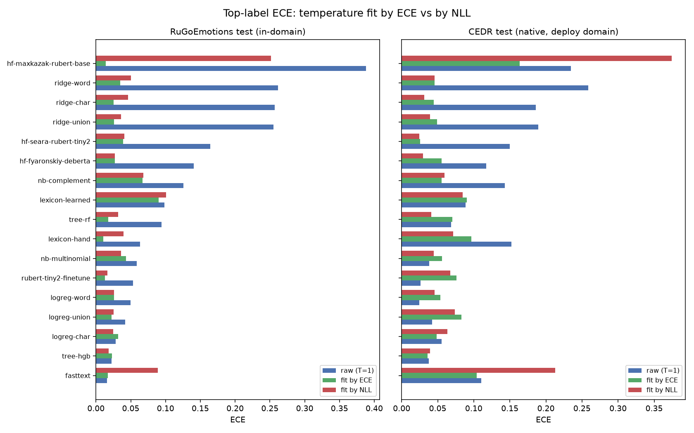
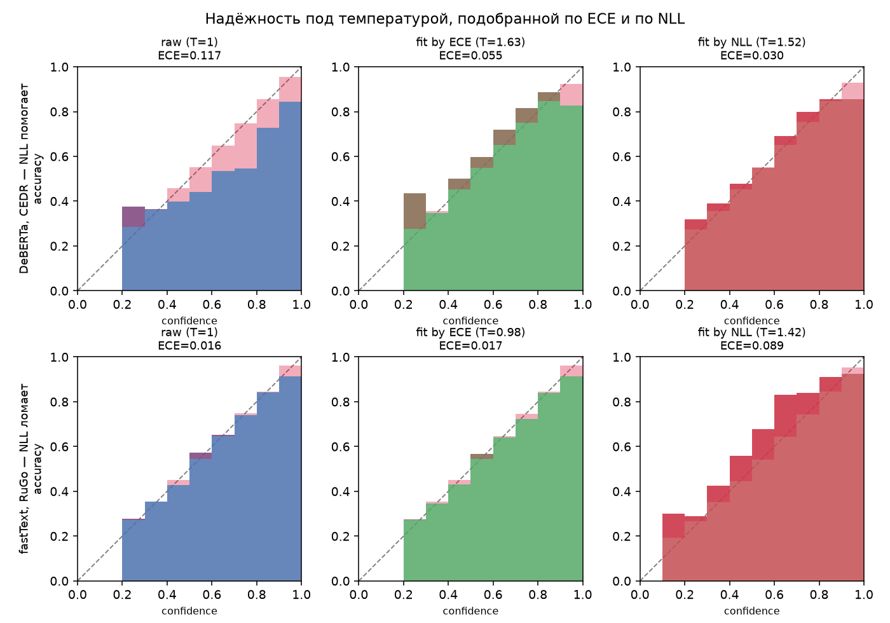

# По какому критерию калибровать температуру: ECE или NLL

Раздел для диплома. Температурная калибровка подбирает один скаляр T, но *по какой
метрике* его минимизировать — открытый вопрос. Здесь — прямое сравнение двух
критериев отбора на всех 20 чекпоинтах. Источник:
`scripts/calibrate_objective_comparison.py` →
`artifacts/experiments/calibration/calibration_objective_comparison.csv`.

## Два критерия

- **ECE-fit** — T минимизирует **val ECE** (top-label калибровка, то, что мы репортим).
  Метрика бинированная, кусочно-постоянная, шумная.
- **NLL-fit** — T минимизирует **val NLL** (= кросс-энтропия = softmax-NLL). Гладкая,
  выпуклая по 1/T. NLL — **строго правильное правило оценки**: оно уникально минимизируется
  истинными вероятностями *среди всех* предсказателей; но температура двигает лишь
  1-параметрическое семейство `softmax(logits/T)`, поэтому NLL-минимизирующий T даёт
  **ближайшего по KL члена этого семейства**, а не сами истинные вероятности (на CEDR KL
  остаётся ~0.9–1.4 нат даже при T_nll). Классика Guo et al., 2017: фитят по NLL, репортят
  ECE. Для soft-меток NLL = KL + const, поэтому NLL-fit ≡ KL-fit.

Метод: T фитится per-model на **RuGo val** обоими критериями (free, без дедбанда, чтобы
изолировать эффект критерия), затем **ECE и KL** считаются на held-out **RuGo test** и
нативном **CEDR test** под raw (T=1) / T_ece / T_nll. ECE = столбик уверенности на
таймлайне; KL = верность всего 7-мерного вектора эмоций.

## RuGo test (in-domain) — ECE

| модель | raw | @T_ece | @T_nll |
|---|---|---|---|
| hf-maxkazak-rubert-base | 0.3883 | **0.0141** | 0.2515 |
| ridge-word | 0.2618 | **0.0349** | 0.0502 |
| ridge-char | 0.2570 | **0.0251** | 0.0461 |
| ridge-union | 0.2552 | **0.0260** | 0.0360 |
| hf-seara-rubert-tiny2 | 0.1641 | **0.0393** | 0.0410 |
| hf-fyaronskiy-deberta | 0.1404 | **0.0270** | 0.0273 |
| nb-complement | 0.1257 | **0.0668** | 0.0683 |
| lexicon-learned | 0.0986 | **0.0899** | 0.1007 |
| tree-rf | 0.0943 | **0.0176** | 0.0321 |
| lexicon-hand | 0.0632 | **0.0104** | 0.0394 |
| nb-multinomial | 0.0584 | 0.0430 | **0.0360** |
| rubert-tiny2-finetune | 0.0535 | **0.0127** | 0.0162 |
| logreg-word | 0.0495 | **0.0261** | 0.0262 |
| logreg-union | 0.0421 | **0.0221** | 0.0254 |
| logreg-char | 0.0284 | 0.0320 | **0.0247** |
| tree-hgb | 0.0226 | 0.0230 | **0.0184** |
| fasttext | **0.0157** | 0.0169 | 0.0888 |

## CEDR test (деплой-домен) — ECE

| модель | raw | @T_ece | @T_nll |
|---|---|---|---|
| hf-maxkazak-rubert-base | 0.2347 | **0.1635** | 0.3745 |
| ridge-word | 0.2584 | 0.0458 | **0.0455** |
| ridge-char | 0.1860 | 0.0445 | **0.0314** |
| ridge-union | 0.1891 | 0.0493 | **0.0393** |
| hf-seara-rubert-tiny2 | 0.1496 | 0.0259 | **0.0246** |
| hf-fyaronskiy-deberta | 0.1173 | 0.0554 | **0.0296** |
| nb-complement | 0.1432 | **0.0553** | 0.0592 |
| lexicon-learned | 0.0886 | 0.0902 | **0.0848** |
| tree-rf | 0.0688 | 0.0704 | **0.0409** |
| lexicon-hand | 0.1523 | 0.0965 | **0.0715** |
| nb-multinomial | **0.0380** | 0.0562 | 0.0444 |
| rubert-tiny2-finetune | **0.0260** | 0.0760 | 0.0677 |
| logreg-word | **0.0244** | 0.0535 | 0.0456 |
| logreg-union | **0.0420** | 0.0827 | 0.0740 |
| logreg-char | 0.0552 | **0.0486** | 0.0637 |
| tree-hgb | 0.0376 | **0.0362** | 0.0395 |
| fasttext | 0.1101 | **0.1038** | 0.2126 |

## KL (верность всего вектора) — представительно

NLL — родной критерий для KL, поэтому ожидаемо ведёт. Полные числа — в CSV; здесь
несколько строк (CEDR test):

| модель | KL raw | KL @T_ece | KL @T_nll |
|---|---|---|---|
| ridge-char | 1.1289 | 0.9122 | **0.9014** |
| hf-fyaronskiy-deberta | 1.0188 | 0.9886 | **0.9781** |
| ridge-union | 1.1916 | 0.9538 | **0.9434** |
| logreg-char | 0.7990 | **0.7962** | 0.8031 |

## Находки (17 не-вырожденных моделей; SE ECE: RuGo ≈ 0.005, CEDR ≈ 0.008)

| где | счёт по ECE | значимо (> 2·SE) | KL |
|---|---|---|---|
| **RuGo test** (in-domain) | ECE-fit 14/17 | ~7/14 (двое крупнейших — патологичные fasttext/maxkazak) | NLL 17/17 (марджины крошечные) |
| **CEDR test** (деплой?) | NLL-fit 12/17 | **только 3/12** (tree-rf, deberta, lexicon-hand) | NLL 14/17 |

1. **In-domain top-label ECE → формально ECE-fit (14/17), но в основном мелко.** Только ~7 из
   14 выигрышей > 2·SE, и два крупнейших — патологичные fasttext/maxkazak (п. 4). Для
   «нормальных» моделей преимущество ECE-fit реальное, но небольшое.
2. **CEDR ECE → формально NLL-fit (12/17), но 9 из 12 — в пределах ~SE (ничьи).** Реальный
   (> 2·SE) кросс-доменный выигрыш NLL — лишь у **3 моделей**: tree-rf (0.070 → 0.041, 3.7·SE),
   deberta (0.055 → 0.030, 3.2·SE), lexicon-hand (0.097 → 0.072, 3.1·SE). Остальное — шум
   (ridge-char только 1.6·SE). «NLL лучше кросс-домен» — это про несколько моделей, не закон.
3. **KL → NLL-fit почти всегда** (RuGo 17/17, CEDR 14/17 — теряет на nb-complement,
   logreg-char, fasttext), но марджины крошечные (KL ~0.9–1.4, разница ~0.01) — практически
   незначимо.
4. **Патология: NLL катастрофически пересмягчает «ненастоящие» логиты.** `fasttext` (ova,
   per-label скоры — не softmax-входы): T_nll = 1.42 → RuGo ECE **0.016 → 0.089**, CEDR
   **0.110 → 0.213**. `maxkazak` (несовпадение схемы меток): T_nll = 20 (потолок) → RuGo
   **0.39 → 0.25** хуже ECE-fit-евых 0.014. ECE-fit на них вменяем.
5. **Для реально деплоящегося `logreg-char` — ECE-fit точечно лучше.** На CEDR T_ece **0.049**
   против T_nll 0.064 — разница **1.9·SE** (не «внутри шума»), и NLL делает его CEDR ECE даже
   **хуже raw** (0.055 → 0.064). Рекомендация в пользу NLL ухудшила бы именно ту модель, что
   идёт в продакшн.

## Иллюстрации

ECE под raw / ECE-fit / NLL-fit по всем моделям, на обоих доменах: in-domain выигрывает
ECE-fit (зелёное), кросс-доменно часто NLL-fit (красное), но на fastText/maxkazak NLL раздувает ECE.



Механизм на двух крайних случаях — где NLL помогает (DeBERTa, CEDR: 0.117→0.030) и где ломает
(fastText: 0.016→0.089, T=1.42 уводит в недоуверенность):



Строит `scripts/plot_objective_comparison.py`.

## Рекомендация для диплома

**Записать ОБА (сравнение — самостоятельный результат), но продакшн-пайплайн оставить
ECE + дедбанд, а NLL подать как разобранную альтернативу/абляцию — НЕ как продакшн.**
Это правка к первому впечатлению «перейти на NLL»: после учёта размеров эффекта и
когерентности вердикт разворачивается.

- **Когерентность.** Все сохранённые/репортируемые числа работы получены ECE + дедбандом
  (а T_nll в сравнении ещё и free, без дедбанда). Рекомендовать метод, которым **ни один
  артефакт не посчитан**, — неконсистентная защита.
- **Размен в основном статистически ничейный.** Для «нормальных» моделей разница ECE между
  критериями чаще в пределах 1–2·SE; ясный кросс-доменный выигрыш NLL — лишь у 3 моделей (п. 2).
- **Безопасность.** ECE + дедбанд устойчив к патологичным логитам (fasttext/maxkazak) без
  отдельного предохранителя. NLL без guard их ломает; а guard «откат к T = 1, если val ECE
  хуже raw» ловит **только fasttext** (lexicon-learned), но **НЕ maxkazak** (под T_nll его
  RuGo ECE даже улучшается 0.39 → 0.25, так что guard не срабатывает) и видит лишь val-домен,
  а не CEDR — лишняя сложность без чистого выигрыша.
- **Деплой-модель.** Для `logreg-char` ECE-fit точечно лучше на CEDR (1.9·SE), а NLL её
  ухудшает — прямой довод против NLL именно там, где он бы применился.
- **Честная оговорка про домен.** Вердикт «NLL лучше» держится на допущении **деплой ≈ CEDR**.
  Под метрикой, которую работа реально репортит (in-domain top-label ECE), выигрывает ECE-fit.
  Это не чистая победа критерия, а ставка на доменный сдвиг.

**Что NLL даёт как абляция (и это стоит написать):** учебниковый критерий (Guo et al.),
гладкий, без шума бинов (дедбанд ему ожидаемо не нужен — отдельно не проверялось); подтверждает,
что у «нормальных» моделей выбор критерия почти не важен; выявляет 3 модели с реальным
кросс-доменным преимуществом и 2 патологичные (fasttext/maxkazak), где он опасен — что само по
себе диагностично.

**Если всё же нужен один метод end-to-end под NLL:** прогнать весь пайплайн под NLL +
ECE-guard (с дедбандом и на guard) и репортить *те* числа — тогда рекомендация станет
когерентной. Но на текущих данных это не даёт чистого выигрыша и проигрывает на деплой-модели,
поэтому по умолчанию — **ECE + дедбанд**.

## Воспроизведение

```bash
python scripts/calibrate_objective_comparison.py     # полный ECE+KL × raw/T_ece/T_nll
```

Примитивы: `best_temperature(objective="ece"|"nll")` и `negative_log_likelihood` в
`src/dialog_emo_models/metrics.py`. Основной прогон (`calibrate_temperature.py`) отбирает по
ECE + дедбанд и репортит `T_nll` как контроль — **это и остаётся продакшн-пайплайном** (см.
рекомендацию); `objective="nll"` доступен как абляция, если захочется прогнать всё end-to-end
по NLL.
